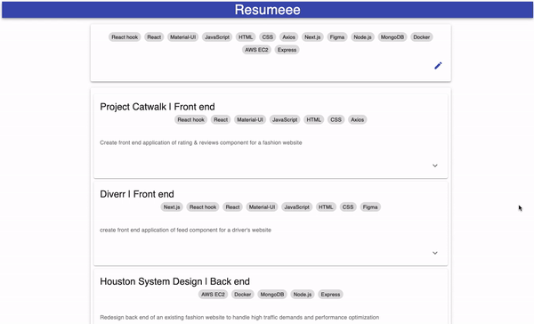

  <h1 align="center">Welcome to <strong>Resumeee</strong>!</h1>

  

    Resumeee is a web application that stores user's projects for easy finding.
      
    The top shows all the technologies used in all the stored projects. When the tag is selected, the projects with that technology will show up below.
      
    Each card holds a project with a project name and technology tags at the top, a project summary in the middle, and a drop-down icon at the bottom. When a user clicked on the drop-down icon, the bullet points for the project will show up.
      
    When the pen icon has clicked, the form for adding a new project to the web will show up below the collection of technology tags.
      
    All the project are stored in the local mongodb.
      
    
  

